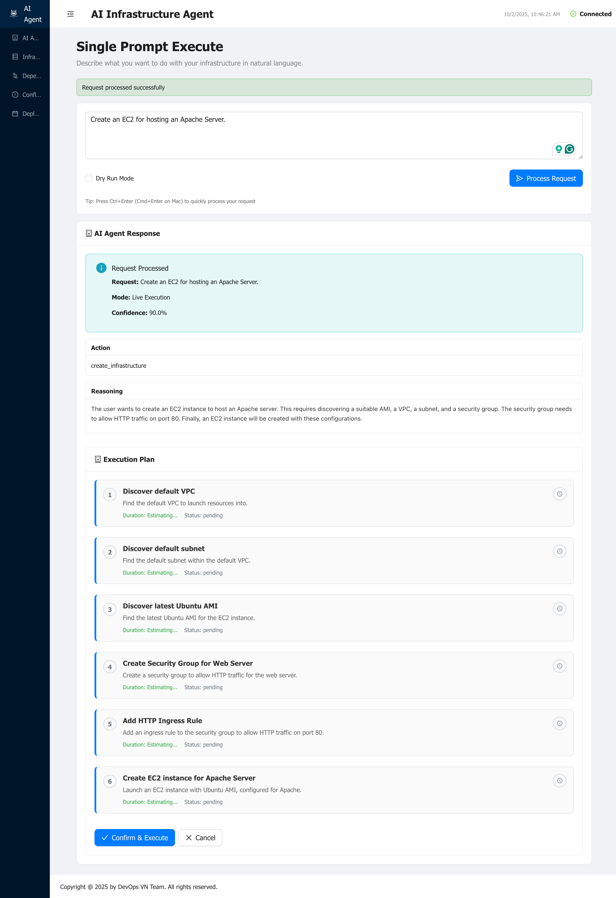
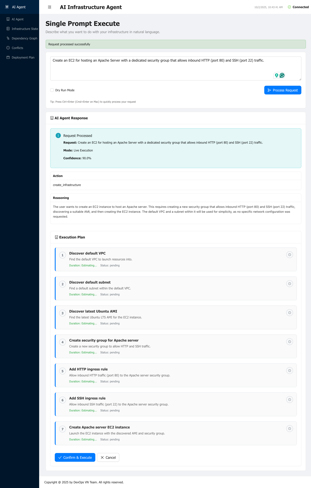
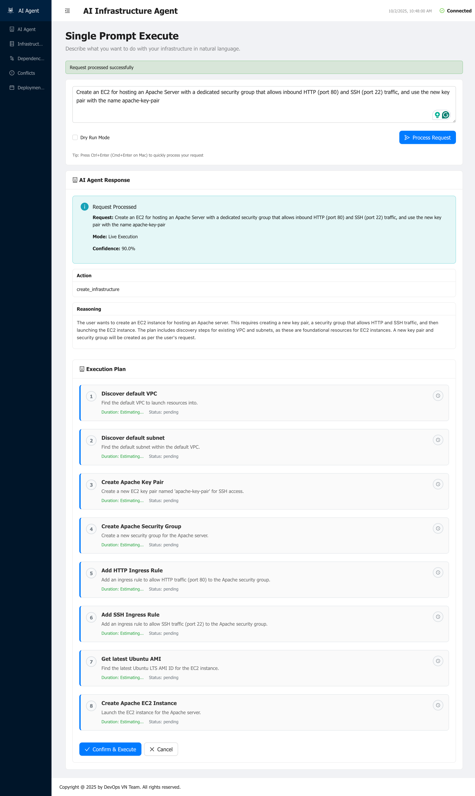
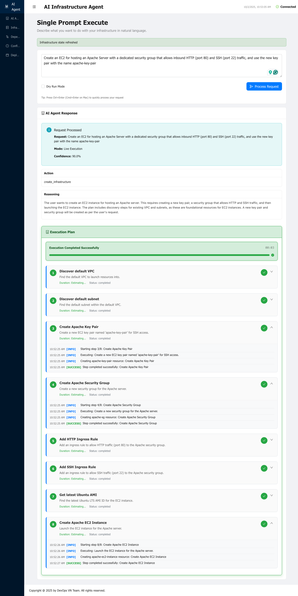
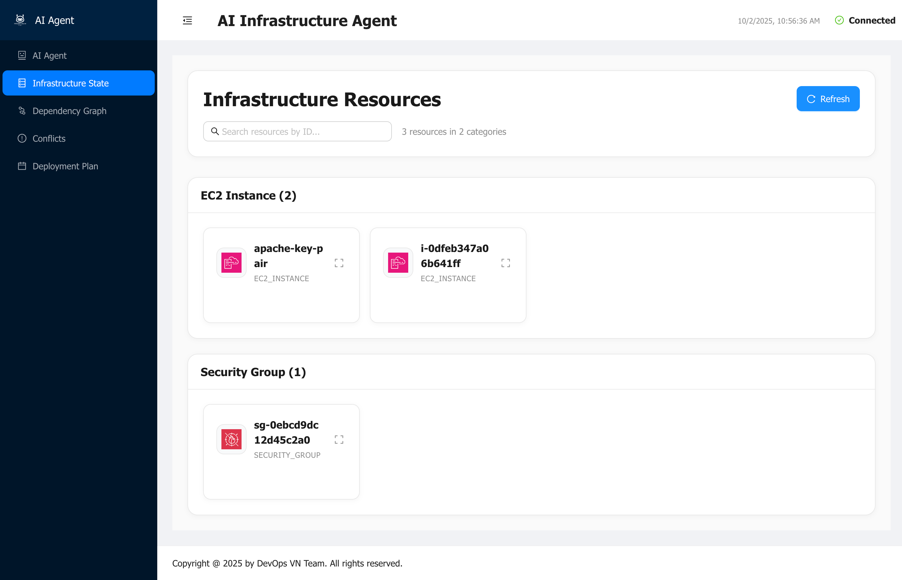
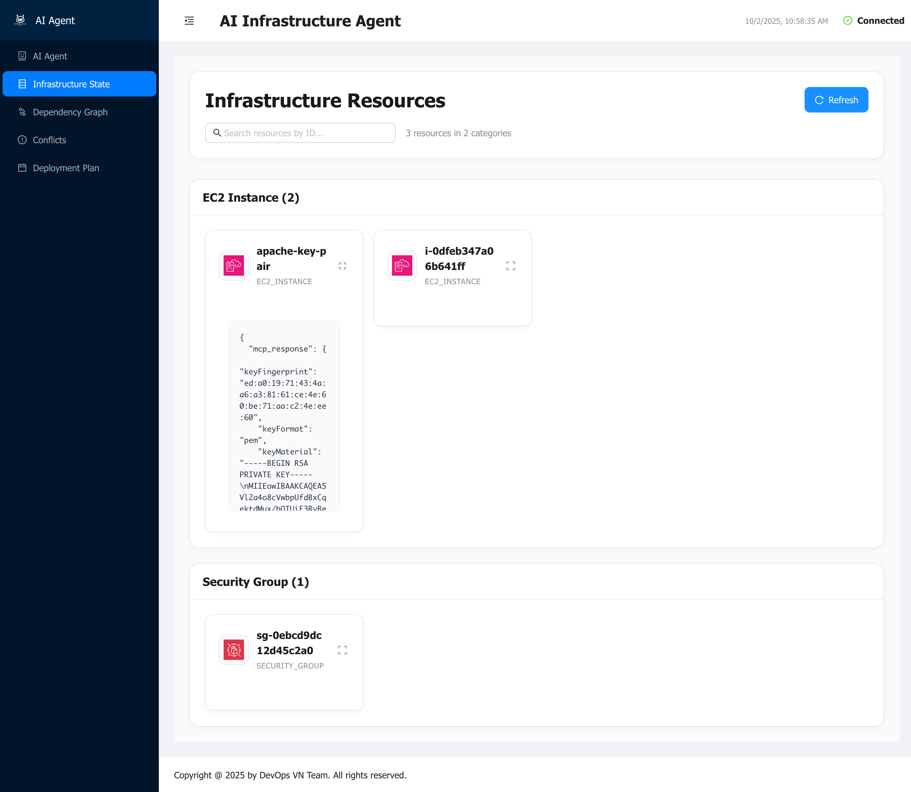

# How to Use the AI Agent to Create an EC2 Instance

Welcome to this comprehensive guide on using the AI Infrastructure Agent to create EC2 instances through natural language commands. This tutorial demonstrates three progressive scenarios, showing you how to build from a basic setup to a complete production-ready infrastructure.

## Quick Start with Docker

The fastest way to get started is using Docker. Follow these steps to have the AI Infrastructure Agent running in minutes:

### Step 1: Clone the Repository

```bash
git clone https://github.com/VersusControl/ai-infrastructure-agent.git
cd ai-infrastructure-agent
```

### Step 2: Configure Your AI Provider

Choose your preferred AI provider and set up the configuration:

```bash
# For OpenAI (Recommended)
cp config.openai.yaml.example config.yaml

# For Google Gemini
cp config.gemini.yaml.example config.yaml

# For AWS Bedrock Nova
cp config.bedrock.yaml.example config.yaml
```

### Step 3: Run with Docker

```bash
# Build and start the container
docker build -t ai-infrastructure-agent .
docker run -d \
  -p 8080:8080 \
  -v $(pwd)/config.yaml:/app/config.yaml \
  -e AWS_ACCESS_KEY_ID=$AWS_ACCESS_KEY_ID \
  -e AWS_SECRET_ACCESS_KEY=$AWS_SECRET_ACCESS_KEY \
  -e AWS_DEFAULT_REGION=$AWS_DEFAULT_REGION \
  --name ai-agent \
  ghcr.io/versuscontrol/ai-infrastructure-agent:v0.0.4
```

Open your browser and navigate to:

```
http://localhost:8080
```

You should see the AI Infrastructure Agent dashboard, ready to accept your infrastructure requests!


> **For detailed installation instructions** including manual setup, troubleshooting, and advanced configurations, please refer to the [Getting Started Guide](../getting-started.md).

## Understanding the AI Agent Workflow

The AI Infrastructure Agent transforms natural language into real AWS infrastructure through a simple workflow:

1. **Enter Request** - Describe your infrastructure needs in plain English
2. **Review Plan** - AI generates a detailed execution plan with all steps
3. **Approve & Execute** - Review and approve the plan, then watch it execute
4. **Verify Resources** - Check the created infrastructure in AWS and the dashboard

Let's walk through three practical scenarios that demonstrate increasing complexity.

## Scenario 1: Basic EC2 Instance for Apache Server

**Goal:** Create a simple EC2 instance suitable for hosting an Apache web server.

### Step 1: Enter Your Request

In the Web UI dashboard, type your infrastructure request in natural language:

```
Create an EC2 instance for hosting an Apache Server
```

Then click **"Process Request"** to let the AI analyze your requirements.

### Step 2: Review the Generated Plan

After processing, the AI agent will present a detailed execution plan:



*The execution plan shows all the steps the agent will take, including:*
- *Discovering the default VPC*
- *Finding an appropriate subnet*
- *Selecting a suitable Amazon Linux AMI*
- *Creating the EC2 instance with proper configuration*

**What you'll see in the plan:**
- **Step-by-step breakdown** of all actions
- **Dependencies** between resources (e.g., need VPC before creating instance)
- **Parameters** like instance type (t3.micro), AMI ID, and subnet selection
- **Resource IDs** that will be used for cross-referencing

### Step 3: Execute and Monitor

Review the plan carefully, then click **"Confirm & Execute"** to start the deployment. The agent will execute each step in the correct order, handling all AWS API calls automatically.

### Important Note About AI Models

> ⚠️ **Different AI models may generate different plans!** 
> 
> The execution plan can vary between OpenAI GPT-4, Google Gemini, and AWS Bedrock Nova based on how each model interprets your request. For more consistent and predictable results:
> - **Specify VPC explicitly**: "using the default VPC" or "using VPC vpc-xxx"
> - **Mention instance type**: "create a t3.small EC2 instance"
> - **Include AMI preference**: "using Amazon Linux 2023 AMI"
> - **State networking needs**: "in a public subnet with auto-assign public IP"

## Scenario 2: EC2 with Dedicated Security Group

**Goal:** Create an EC2 instance with a custom security group that properly allows HTTP and SSH access.

### Step 1: Enter a More Specific Request

Build on the previous scenario by adding security requirements:

```
Create an EC2 instance for hosting an Apache Server with a dedicated security group that allows inbound HTTP (port 80) and SSH (port 22) traffic
```

Click **"Process Request"** to generate the plan.

### Step 2: Review the Enhanced Plan

The AI will now generate a more comprehensive plan that includes security configuration:



*The enhanced execution plan now includes additional steps for:*
- *Creating a new security group with a descriptive name*
- *Adding an inbound rule for HTTP traffic (port 80) from 0.0.0.0/0*
- *Adding an inbound rule for SSH traffic (port 22) from 0.0.0.0/0*
- *Attaching the security group to the EC2 instance*

**What's different from Scenario 1:**
- **Additional steps** for security group creation
- **Security rules** explicitly defined with ports and CIDR blocks
- **Proper dependencies** ensuring security group exists before EC2 creation
- **Resource naming** for easier identification in AWS Console

### Step 3: Understanding Security Best Practices

The agent will configure security rules based on your request. By default:
- **Port 80 (HTTP)**: Open to `0.0.0.0/0` (internet access for web traffic)
- **Port 22 (SSH)**: Open to `0.0.0.0/0` (should be restricted in production!)

## Scenario 3: Complete Configuration with SSH Key Pair

**Goal:** Create a production-ready EC2 instance with custom security group AND a new SSH key pair for secure access.

### Step 1: Request Complete Infrastructure

Now let's create a fully configured setup with all security components:

```
Create an EC2 instance for hosting an Apache Server with a dedicated security group that allows inbound HTTP (port 80) and SSH (port 22) traffic, and use a new key pair with the name apache-key-pair
```

Click **"Process Request"** to generate the comprehensive plan.

### Step 2: Review the Complete Execution Plan

The AI generates the most comprehensive plan yet:



*The full execution plan now includes:*
- *Key pair creation as the first step*
- *Security group creation with HTTP and SSH rules*
- *EC2 instance creation with all components properly linked*
- *Proper sequencing to ensure dependencies are met*

**Complete resource creation order:**
1. **Create SSH key pair** (`apache-key-pair`)
2. **Create security group** with inbound rules
3. **Launch EC2 instance** with key pair and security group attached

### Step 3: Execute and Watch the Progress

Click **"Confirm & Execute"** to start the deployment process:



*During execution, you'll see:*
- *Each step executing sequentially*
- *Real-time status updates (Pending → In Progress → Completed)*
- *Resource IDs being captured and passed between steps*
- *Success indicators as each resource is created*

**What happens during execution:**
- ✅ Key pair is created and private key is generated
- ✅ Security group is created with specified rules
- ✅ EC2 instance is launched with all configurations
- ✅ All resource IDs are tracked in the state management system

### Step 4: Verify Infrastructure State

After successful execution, check your infrastructure in the dashboard:



*The Infrastructure Resources State shows:*
- *All created resources with their AWS resource IDs*
- *Resource types (EC2 Instance, Security Group, Key Pair)*
- *Current state and status*
- *Relationships and dependencies between resources*

This state view gives you a complete inventory of your infrastructure, making it easy to track what was created and how resources are connected.

### Step 5: Retrieve Your SSH Key Pair

To access your EC2 instance, you need the private key. Expand the key pair resource to view and copy the key:



*Click on the key pair resource to expand it and reveal the private key content. Use the copy button to securely copy the key value.*

>
> **Steps to save your key:**
> ```bash
> # Create the .ssh directory if it doesn't exist
> mkdir -p ~/.ssh
> 
> # Create the key file and paste the content
> nano ~/.ssh/apache-key-pair.pem
> # Paste the copied key, then save (Ctrl+X, Y, Enter)
> 
> # Set proper permissions (required for SSH)
> chmod 400 ~/.ssh/apache-key-pair.pem
> ```
>
> **Why permissions matter:** SSH requires private keys to be read-only by the owner. If permissions are too open, SSH will refuse to use the key for security reasons.

### Step 6: Verify Resources in AWS Console

Now let's verify that the resources were actually created in your AWS account.

**Check the Key Pair in AWS Console:**


*Navigate to EC2 → Key Pairs in the AWS Console to confirm your `apache-key-pair` was created successfully. You'll see the key pair name, ID, and creation timestamp.*

**Check the EC2 Instance in AWS Console:**


*Navigate to EC2 → Instances to see your newly created Apache server instance. Verify:*
- *Instance is in "running" state*
- *Correct instance type (e.g., t3.micro)*
- *Security group is attached*
- *Key pair name matches "apache-key-pair"*
- *Public IP address is assigned (for SSH access)*

### Step 7: Connect to Your Instance

With everything verified, you can now SSH into your EC2 instance:

```bash
# Get the public IP from the AWS Console or dashboard
# Replace <instance-public-ip> with your actual IP address

ssh -i ~/.ssh/apache-key-pair.pem ec2-user@<instance-public-ip>
```

**First-time connection:**
```bash
The authenticity of host 'xxx.xxx.xxx.xxx' can't be established.
ECDSA key fingerprint is SHA256:xxxx...
Are you sure you want to continue connecting (yes/no)? yes
```

Type `yes` and press Enter. You should now be connected to your EC2 instance!

## Tips for Getting Better Results from Different AI Models

Different AI models (OpenAI GPT-4, Google Gemini, AWS Bedrock Nova) may interpret your requests differently. Here's how to write prompts that produce consistent, accurate infrastructure plans:

### ✅ Be Specific About Your VPC

**Instead of this:**
```
Create an EC2 instance
```

**Use this:**
```
Create an EC2 instance using the default VPC
```

**Or even better (if you know your VPC ID):**
```
Create an EC2 instance using VPC with ID vpc-1234567890abcdef0
```

**Why it matters:** Without VPC specification, different AI models might make different assumptions about where to place your instance.

### ✅ Specify Instance Type and Size

**Instead of this:**
```
Create an EC2 instance for Apache
```

**Use this:**
```
Create a t3.medium EC2 instance for Apache Server
```

**Why it matters:** Instance type affects performance and cost. Being explicit ensures you get what you need.

### ✅ Be Explicit About Network Placement

**Instead of this:**
```
Create an EC2 instance
```

**Use this:**
```
Create an EC2 instance in a public subnet with auto-assign public IP enabled
```

**Or specify exact subnet:**
```
Create an EC2 instance in subnet subnet-abc123 with public IP
```

**Why it matters:** Subnet choice determines network accessibility. Public subnets are needed for internet-facing services.

### ✅ Provide Detailed Security Requirements

**Instead of this:**
```
Create an EC2 with security group
```

**Use this:**
```
Create an EC2 instance with a security group allowing HTTP (port 80) from 0.0.0.0/0 and SSH (port 22) from 203.0.113.25/32
```

**Why it matters:** Security is critical. Explicit rules prevent overly permissive or overly restrictive configurations.

### ✅ Specify Operating System Preferences

**Instead of this:**
```
Create an EC2 instance
```

**Use this:**
```
Create an EC2 instance using Amazon Linux 2023 AMI
```

**Or for Ubuntu:**
```
Create an EC2 instance using Ubuntu 22.04 LTS AMI
```

**Why it matters:** Different Linux distributions have different package managers and configurations.

### ✅ Include Availability Zone When Needed

**Instead of this:**
```
Create an EC2 instance
```

**Use this:**
```
Create an EC2 instance in us-east-1a availability zone
```

**Why it matters:** Useful when you need resources in specific AZs for redundancy or proximity to other resources.

---

## Conclusion

Congratulations! You've learned how to use the AI Infrastructure Agent to create EC2 instances with increasing levels of complexity:

✅ **Scenario 1:** Basic EC2 instance with minimal configuration  
✅ **Scenario 2:** EC2 with custom security group and specific network rules  
✅ **Scenario 3:** Complete production-ready setup with key pair, security, and full configuration

### Key Takeaways

1. **Natural language is powerful** - Describe infrastructure needs in plain English
2. **Be specific for consistency** - Different AI models need clear, detailed prompts
3. **Review before executing** - Always check the generated plan carefully
4. **Verify in AWS Console** - Confirm resources match your expectations
5. **Follow security best practices** - Especially for production environments

Happy building with AI!
