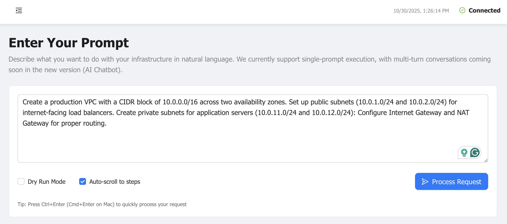
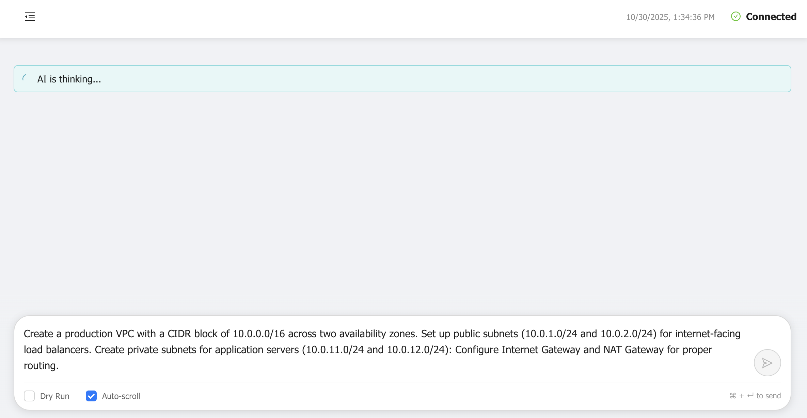
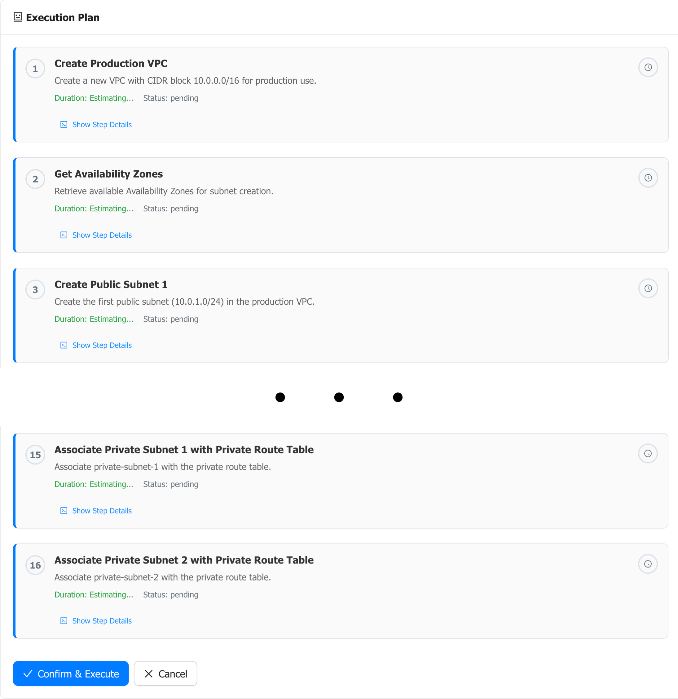
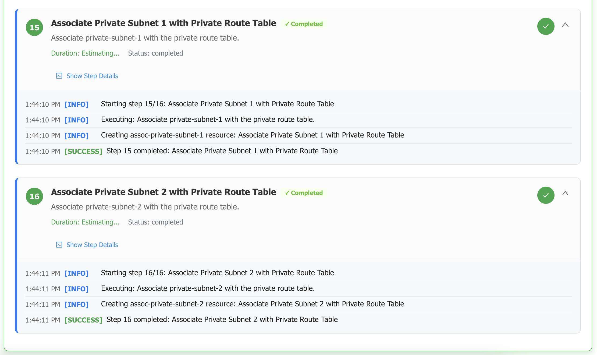
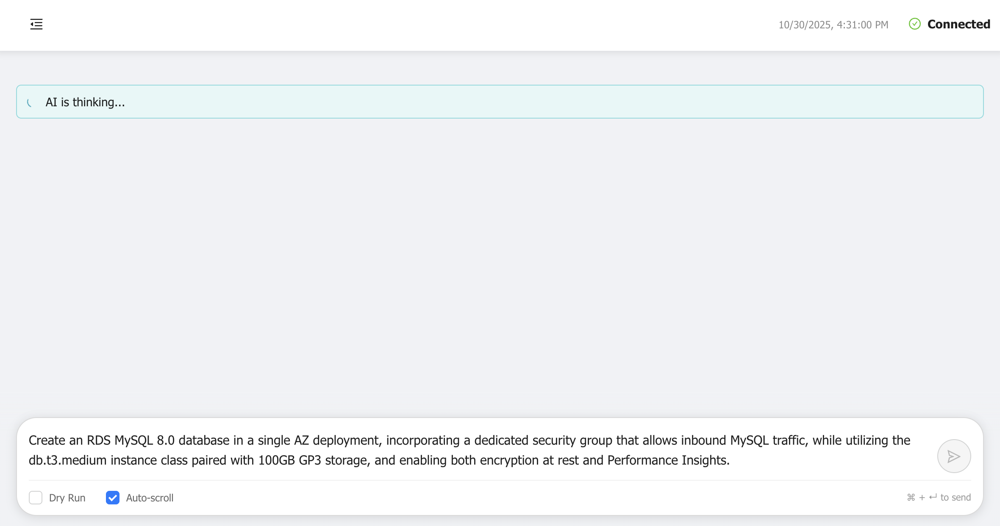
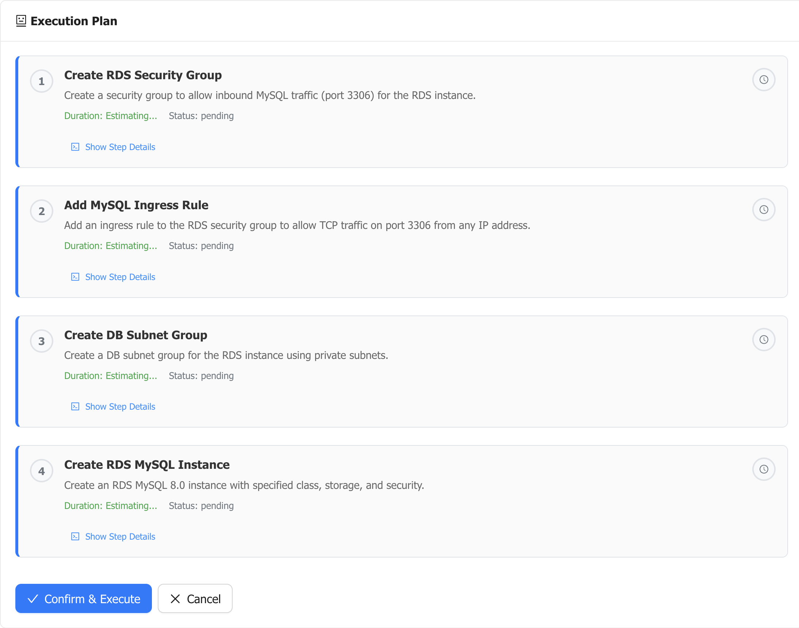
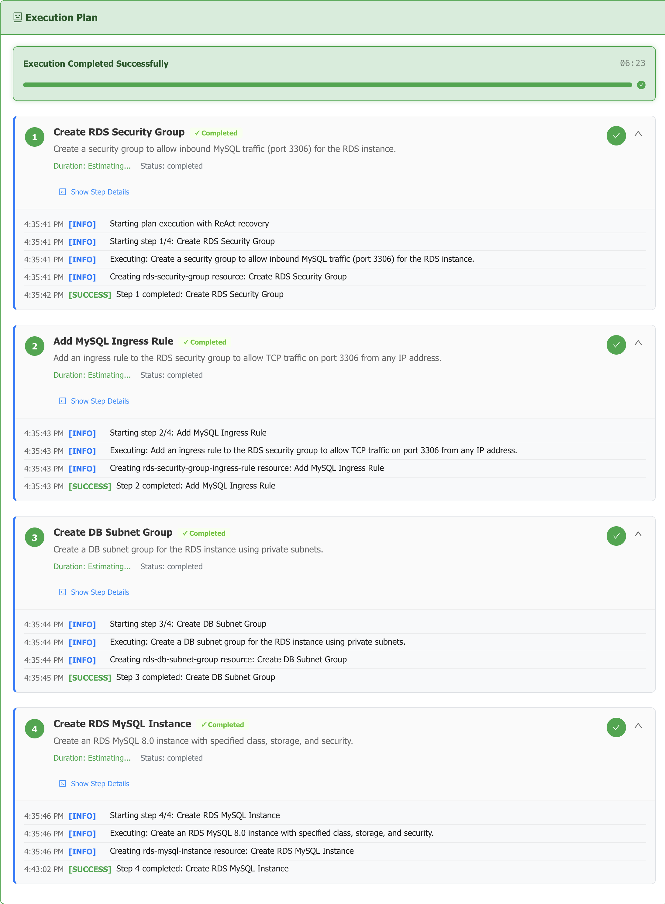
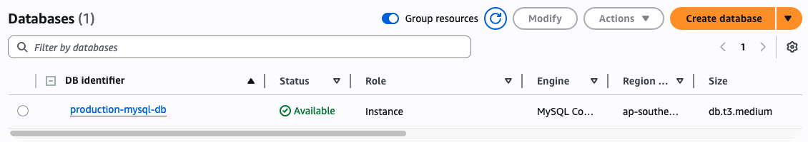

# How to Use the AI Agent to Create Amazon RDS Database

Welcome to this comprehensive guide on using the AI Infrastructure Agent to create a production-ready RDS MySQL database through natural language commands. This tutorial demonstrates how to build a complete database infrastructure with proper networking, security groups, and best practices for encryption and monitoring.

## Quick Start with Docker

The fastest way to get started is using Docker. Follow these steps to have the AI Infrastructure Agent running in minutes:

### Step 1: Clone the Repository

```bash
git clone https://github.com/VersusControl/ai-infrastructure-agent.git
cd ai-infrastructure-agent
```

### Step 2: Configure Your AI Provider

Choose your preferred AI provider and set up the configuration:

```bash
# For Google Gemini (Recommended)
cp config.gemini.yaml.example config.yaml

# For OpenAI
cp config.openai.yaml.example config.yaml

# For AWS Bedrock Nova
cp config.bedrock.yaml.example config.yaml
```

### Step 3: Run with Docker

```
mkdir states
```

```bash
docker run -d \
  -p 8080:8080 \
  -v $(pwd)/config.yaml:/app/config.yaml \
  -v $(pwd)/states:/app/states \
  -e GEMINI_API_KEY="your-gemini-api-key-here" \
  -e AWS_ACCESS_KEY_ID=$AWS_ACCESS_KEY_ID \
  -e AWS_SECRET_ACCESS_KEY=$AWS_SECRET_ACCESS_KEY \
  -e AWS_DEFAULT_REGION=$AWS_DEFAULT_REGION \
  --name ai-agent \
  ghcr.io/versuscontrol/ai-infrastructure-agent
```

Open your browser and navigate to:

```
http://localhost:8080
```

You should see the AI Infrastructure Agent dashboard, ready to accept your infrastructure requests!


> **For detailed installation instructions** including manual setup, troubleshooting, and advanced configurations, please refer to the [Getting Started Guide](../getting-started.md).

## Understanding RDS Database Architecture

A well-designed RDS database deployment requires proper network isolation and security configurations. This guide walks you through creating a production-ready RDS MySQL database with:

- **VPC Infrastructure**: Isolated network with public and private subnets across multiple availability zones
- **DB Subnet Groups**: Subnets where your RDS instance will be deployed
- **Security Groups**: Fine-grained access control for database connections
- **Encryption**: Data encryption at rest for security compliance
- **Performance Insights**: Advanced monitoring and troubleshooting capabilities

Let's build this infrastructure step by step using natural language commands.

## Part 1: Create the VPC Foundation

**Goal:** Set up a production-ready VPC with proper network segmentation across multiple availability zones.

### Step 1: Enter Your VPC Request

Before creating an RDS database, we need a properly configured VPC. In the Web UI dashboard, type your infrastructure request in natural language:

```
Create a production VPC with a CIDR block of 10.0.0.0/16 across two availability zones. Set up public subnets (10.0.1.0/24 and 10.0.2.0/24) for internet-facing load balancers. Create private subnets for application servers (10.0.11.0/24 and 10.0.12.0/24): Configure Internet Gateway and NAT Gateway for proper routing.
```

Then click **"Process Request"** to let the AI analyze your requirements.



*Enter your VPC creation request in the dashboard. The AI will analyze the requirements and generate a comprehensive execution plan.*

### Step 2: Review the VPC Execution Plan

After processing, you'll see a "Processing..." indicator while the AI generates the plan:



*The AI agent processes your natural language request and generates a detailed execution plan with all necessary steps.*

The AI agent will present a detailed execution plan showing all the steps required to create the VPC infrastructure:



*The execution plan includes:*
- *VPC creation with 10.0.0.0/16 CIDR block*
- *Public and private subnets across two availability zones*
- *Internet Gateway for public subnet connectivity*
- *NAT Gateway for private subnet outbound access*
- *Route tables with proper routing configuration*
- *Subnet associations for correct traffic flow*

**What's included in the plan:**
1. **VPC Creation**: Main VPC with 10.0.0.0/16 CIDR block
2. **Public Subnets**: Two subnets (10.0.1.0/24 and 10.0.2.0/24) for internet-facing resources
3. **Private Subnets**: Two subnets (10.0.11.0/24 and 10.0.12.0/24) for application servers
4. **Internet Gateway**: For public subnet internet connectivity
5. **NAT Gateway**: For private subnet outbound internet access
6. **Route Tables**: Properly configured for public and private traffic patterns
7. **Subnet Associations**: All subnets associated with correct route tables

### Step 3: Execute and Monitor VPC Creation

Review the plan carefully, then click **"Confirm & Execute"** to start the deployment. The agent will execute each step in the correct order, handling all AWS API calls automatically.



*The VPC infrastructure is created successfully. All components including subnets, gateways, and route tables are now ready for the RDS deployment.*

**VPC Creation Results:**
- Production VPC with proper CIDR allocation
- High availability across two availability zones
- Segregated public and private subnets
- Internet Gateway for public access
- NAT Gateway for secure outbound connectivity
- Proper routing configuration

> **Note:** The VPC ID and subnet IDs generated during this step will be automatically referenced by the AI agent when creating the RDS database in the next part. You don't need to manually track these IDs!

## Part 2: Create the RDS MySQL Database

**Goal:** Deploy a production-ready RDS MySQL 8.0 database with security best practices, encryption, and monitoring enabled.

### Step 1: Enter Your RDS Request

Now that we have a VPC, let's create the RDS database. In the dashboard, enter your database requirements:

```
Create an RDS MySQL 8.0 database in a single AZ deployment, incorporating a dedicated security group that allows inbound MySQL traffic, while utilizing the db.t3.medium instance class paired with 100GB GP3 storage, and enabling both encryption at rest and Performance Insights.
```

Click **"Process Request"** to generate the RDS deployment plan.



*Enter your RDS creation request. The AI will understand the database specifications, security requirements, and monitoring needs.*

### Step 2: Review the RDS Execution Plan

The AI agent processes your request and generates a comprehensive plan:



*The execution plan includes:*
- *DB Subnet Group creation spanning multiple availability zones*
- *Dedicated security group with MySQL port 3306 access rules*
- *RDS MySQL 8.0 instance with db.t3.medium class*
- *100GB GP3 storage for optimal performance*
- *Encryption at rest enabled using AWS KMS*
- *Performance Insights enabled for monitoring*
- *Automated backups and maintenance window configuration*

**What's included in the RDS plan:**
**DB Subnet Group**: Contains the private subnets from Part 1 for database deployment
2. **Security Group**: Dedicated security group with inbound rule for MySQL (port 3306)
**RDS Instance**: MySQL 8.0 database with the following specifications:
- Instance class: `db.t3.medium`
- Storage: 100GB GP3 (General Purpose SSD)
- Multi-AZ: Single AZ deployment
- Encryption: Enabled at rest
- Performance Insights: Enabled for query monitoring
- Automated backups: Configured with retention period
- Master username and password: Automatically generated

### Step 3: Execute and Monitor RDS Creation

Review the comprehensive plan, then click **"Confirm & Execute"** to deploy your RDS database:



*The RDS MySQL database is being created. This process typically takes 10-15 minutes as AWS provisions the database instance, configures storage, sets up encryption, and initializes Performance Insights.*

**RDS Creation Progress:**
- DB Subnet Group created across availability zones
- Security group configured with MySQL access
- RDS instance provisioned with db.t3.medium
- 100GB GP3 storage allocated and encrypted
- Performance Insights enabled
- Automated backups configured
- Master credentials generated

> **Important:** The RDS creation process can take 10-15 minutes. The AI agent will wait for the database to become available before marking the step as complete.

### Step 4: Verify in AWS Console

After execution completes, verify the RDS database in the AWS Console:



*Navigate to RDS → Databases in the AWS Console to verify:*
- *Database is in "Available" status*
- *Engine version is MySQL 8.0*
- *Instance class is db.t3.medium*
- *Storage shows 100GB GP3*
- *Encryption is enabled*
- *Performance Insights is active*
- *Database endpoint is ready for connections*

**What to verify in AWS Console:**
- Database status: "Available"
- Engine: MySQL 8.0.x
- Instance size: db.t3.medium
- Storage: 100GB GP3
- Encryption: Enabled
- Performance Insights: Active
- VPC: Deployed in the correct VPC
- Subnet group: Using the created DB subnet group
- Security group: Dedicated security group attached

### Step 5: Retrieve Database Credentials

To connect to your RDS database, you'll need the connection details. Check the Infrastructure Resources page in the AI Agent dashboard:

**Connection Information:**
- **Endpoint**: Find the database endpoint hostname (e.g., `mydb.xxxxxxxxxxxx.region.rds.amazonaws.com`)
- **Port**: 3306 (MySQL default)
- **Username**: Check the master username in the database details
- **Password**: Retrieve from AWS Secrets Manager or the agent's state if stored

> **Security Best Practice:** Store database credentials in AWS Secrets Manager and use IAM authentication for applications. Never hardcode credentials in your application code.

**Example connection string:**
```bash
mysql -h mydb.xxxxxxxxxxxx.ap-southeast-1.rds.amazonaws.com \
      -P 3306 \
      -u admin \
      -p
```

## Conclusion

You've successfully used the AI Infrastructure Agent to create a complete RDS MySQL database infrastructure through natural language commands. The agent handled all the complexity of:

- Setting up a production-ready VPC with proper network segmentation
- Creating DB subnet groups across availability zones
- Configuring security groups with appropriate access rules
- Provisioning an RDS MySQL instance with encryption and monitoring
- Enabling Performance Insights for query optimization

This infrastructure provides a solid foundation for production applications with security, performance, and monitoring best practices built in. The natural language interface makes it easy to create complex infrastructure without needing to remember specific AWS API parameters or manual console steps.
