# How to Deploy a Complete Three-Tier Web Application Infrastructure

Welcome to this comprehensive guide on using the AI Infrastructure Agent to create a production-ready three-tier web application infrastructure through natural language commands. This tutorial demonstrates how to build a complete enterprise-grade infrastructure with load balancing, auto-scaling, and database components across multiple availability zones in Singapore.

## Quick Start with Docker

The fastest way to get started is using Docker. Follow these steps to have the AI Infrastructure Agent running in minutes:

### Step 1: Clone the Repository

```bash
git clone https://github.com/VersusControl/ai-infrastructure-agent.git
cd ai-infrastructure-agent
```

### Step 2: Configure Your AI Provider

Choose your preferred AI provider and set up the configuration:

```bash
# For Google Gemini (Recommended)
cp config.gemini.yaml.example config.yaml

# For OpenAI
cp config.openai.yaml.example config.yaml

# For AWS Bedrock Nova
cp config.bedrock.yaml.example config.yaml
```

### Step 3: Run with Docker

```
mkdir states
```

```bash
docker run -d \
  -p 8080:8080 \
  -v $(pwd)/config.yaml:/app/config.yaml \
  -v $(pwd)/states:/app/states \
  -e GEMINI_API_KEY="your-gemini-api-key-here" \
  -e AWS_ACCESS_KEY_ID=$AWS_ACCESS_KEY_ID \
  -e AWS_SECRET_ACCESS_KEY=$AWS_SECRET_ACCESS_KEY \
  -e AWS_DEFAULT_REGION=$AWS_DEFAULT_REGION \
  --name ai-agent \
  ghcr.io/versuscontrol/ai-infrastructure-agent
```

Open your browser and navigate to:

```
http://localhost:8080
```

You should see the AI Infrastructure Agent dashboard, ready to accept your infrastructure requests!


> **For detailed installation instructions** including manual setup, troubleshooting, and advanced configurations, please refer to the [Getting Started Guide](../getting-started.md).

## Understanding Three-Tier Architecture

A well-designed three-tier architecture provides the foundation for scalable, secure, and highly available web applications. This guide walks you through creating a production-ready infrastructure with:

- **Presentation Tier**: Application Load Balancer distributing traffic across availability zones
- **Application Tier**: Auto-scaling group of web servers in private subnets
- **Data Tier**: Multi-AZ RDS database with automated backups and encryption

The architecture includes:
- **Network Segmentation**: Separate subnets for each tier with proper security groups
- **High Availability**: Resources distributed across multiple availability zones
- **Auto Scaling**: Automatic scaling based on demand with health checks
- **Security**: Defense-in-depth security with layered access controls
- **Monitoring**: Performance Insights and health checks for proactive monitoring

Let's build this infrastructure step by step using natural language commands across five phases.

## Phase 1: Network Foundation

**Goal:** Create a robust VPC foundation with proper network segmentation across multiple availability zones.

### Enter Your Network Foundation Request

In the Web UI dashboard, we'll start by creating the complete network infrastructure. Enter the following comprehensive request:

```
I need to deploy a complete production-ready three-tier web application infrastructure on AWS in the Region Singapore with the following requirements:

Network Foundation (Phase 1):
- Create a production VPC with a CIDR block of 10.0.0.0/16 across two availability zones.
- Set up public subnets (10.0.1.0/24 and 10.0.2.0/24) for internet-facing load balancers.
- Create private subnets for application servers (10.0.11.0/24 and 10.0.12.0/24).
- Set up dedicated database subnets (10.0.21.0/24 and 10.0.22.0/24)
- Configure Internet Gateway and NAT Gateway for proper routing.
```

Click **"Process Request"** to let the AI analyze your network requirements.

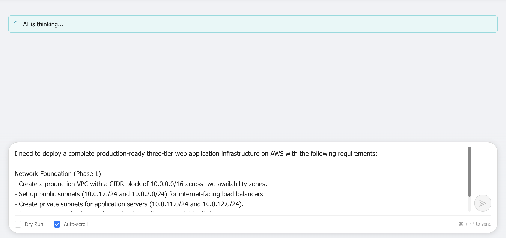

*Enter the network foundation request in the dashboard. The AI will analyze the requirements and generate a comprehensive execution plan for the VPC infrastructure.*

### Review and Execute Network Infrastructure

The AI agent will generate a detailed execution plan showing all the network components required for your three-tier architecture. Review the plan carefully, then click **"Confirm & Execute"** to start the deployment.

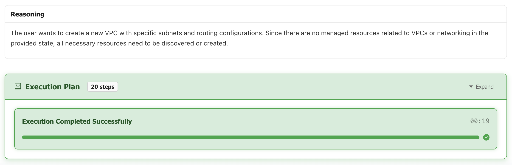

*After execution completes, the network foundation is successfully created with all components properly configured:*
- *Production VPC with 10.0.0.0/16 CIDR block*
- *Six subnets across three tiers and two availability zones*
- *Internet Gateway for public subnet connectivity*
- *NAT Gateway for private subnet outbound access*
- *Route tables with proper routing configuration*
- *Subnet associations for correct traffic flow*

> **For detailed VPC creation guide** including step-by-step subnet configuration and routing setup, please refer to the [Working with VPC Guide](working-with-vpc.md).

**What's created in Phase 1:**
1. **VPC**: Production VPC with 10.0.0.0/16 CIDR block in ap-southeast-1
2. **Public Subnets**: Two subnets (10.0.1.0/24, 10.0.2.0/24) for load balancers
3. **Application Subnets**: Two private subnets (10.0.11.0/24, 10.0.12.0/24) for web servers
4. **Database Subnets**: Two isolated subnets (10.0.21.0/24, 10.0.22.0/24) for RDS
5. **Internet Gateway**: Enables public subnet internet connectivity
6. **NAT Gateway**: Provides secure outbound internet access for private subnets
7. **Route Tables**: Properly configured for three-tier routing

The network foundation is now ready to support the application infrastructure!

## Phase 2: Security Architecture

**Goal:** Implement defense-in-depth security with tiered security groups for each layer.

### Enter Your Security Architecture Request

Now let's create the security groups that will control access between the tiers:

```
Security Architecture (Phase 2):
- Create defense-in-depth security with tiered security groups
- Load balancer security group allowing HTTP/HTTPS from internet (0.0.0.0/0)
- Application server security group accepting traffic only from load balancer
- Database security group allowing MySQL (port 3306) only from application servers
```

Click **"Process Request"** to generate the security infrastructure plan.

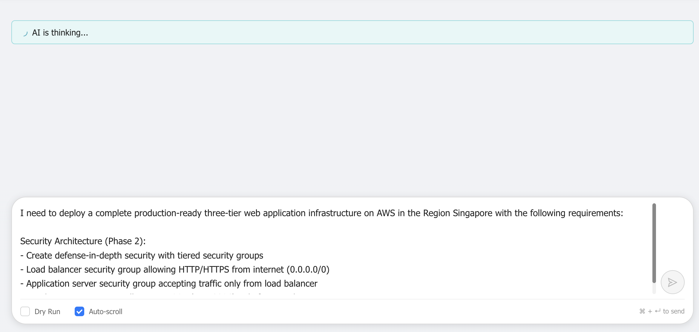

*Enter the security architecture request. The AI will create a layered security model with properly configured access controls between tiers.*

### Review and Execute Security Groups

Review the security group configuration plan, then click **"Confirm & Execute"** to create the tiered security architecture.

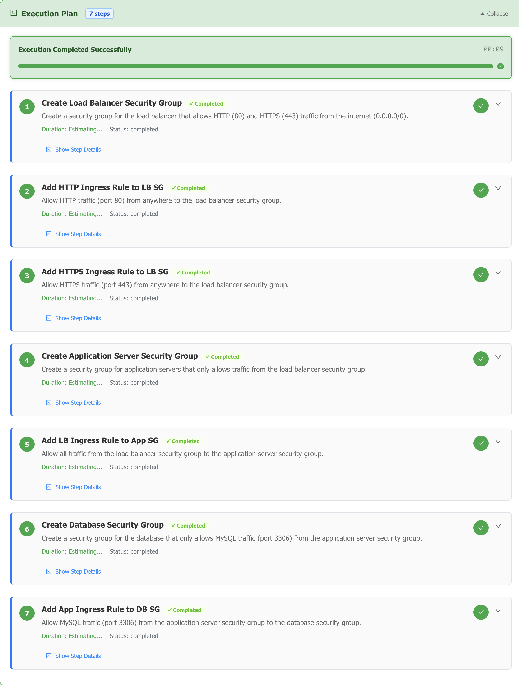

*After execution, the security architecture is successfully implemented with:*
- *Load balancer security group with HTTP/HTTPS access from internet*
- *Application security group accepting traffic only from load balancer*
- *Database security group allowing MySQL access only from application servers*
- *Proper ingress and egress rules for each tier*

**Security Groups Created:**
1. **Load Balancer Security Group**: 
   - Inbound: HTTP (80) and HTTPS (443) from 0.0.0.0/0
   - Outbound: All traffic to application servers
2. **Application Server Security Group**:
   - Inbound: HTTP (80) from load balancer security group only
   - Outbound: HTTPS (443) for updates and MySQL (3306) to database
3. **Database Security Group**:
   - Inbound: MySQL (3306) from application server security group only
   - Outbound: None (database doesn't need outbound access)

### Verify Security Groups in AWS Console

After execution, verify the security groups in the AWS Console:

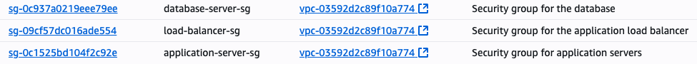

*Navigate to EC2 → Security Groups in the AWS Console to verify:*
- *Three security groups are created with descriptive names*
- *Each security group has the correct inbound and outbound rules*
- *Security group references are properly configured between tiers*
- *No unnecessary open access or overprivileged rules*

The security foundation ensures that each tier can only communicate with its intended neighbors, creating a robust defense-in-depth architecture.

## Phase 3: Load Balancer Tier

**Goal:** Deploy an Application Load Balancer to distribute traffic across application servers with proper health checks.

### Enter Your Load Balancer Request

Let's create the Application Load Balancer for the presentation tier:

```
Load Balancer Tier (Phase 3):
- Deploy Application Load Balancer across public subnets in both AZs
- Configure target group with health checks on /health endpoint
- Set up HTTP listener (port 80) with proper health check thresholds
- Health check: 30s interval, 5s timeout, 2 healthy/3 unhealthy thresholds
```

Click **"Process Request"** to generate the load balancer deployment plan.

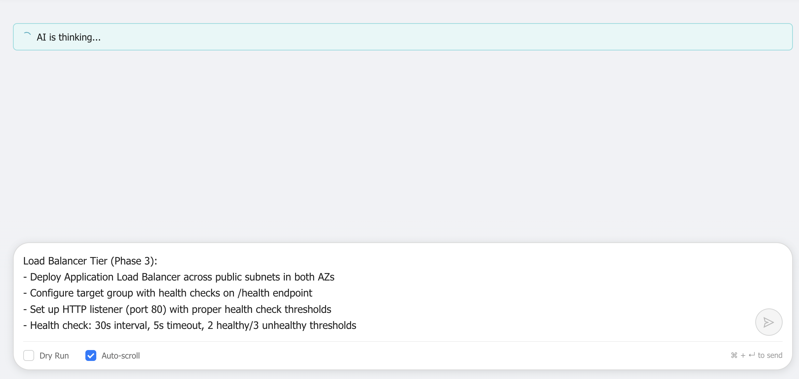

*Enter the load balancer configuration request. The AI will create an Application Load Balancer with proper health checks and target groups.*

### Understanding Resource Reuse and Execution

The AI agent intelligently reuses existing resources from previous phases. Review the execution plan, then click **"Confirm & Execute"** to deploy the load balancer.

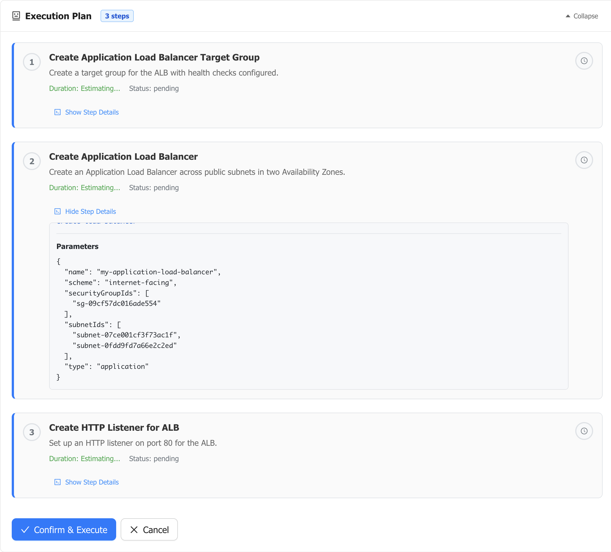

*The execution plan shows the AI agent automatically referencing existing resources from previous phases:*

**Smart Resource Referencing:**
```json
Parameters
{
  "name": "my-application-load-balancer",
  "scheme": "internet-facing",
  "securityGroupIds": [
    "sg-09cf57dc016ade554"
  ],
  "subnetIds": [
    "subnet-07ce001cf3f73ac1f",
    "subnet-0fdd9fd7a66e2c2ed"
  ],
  "type": "application"
}
```

**How the AI Agent Works:**
- **Security Group Reuse**: Automatically references `sg-09cf57dc016ade554` (load-balancer-sg) created in Phase 2
- **Subnet Selection**: Uses the public subnets from Phase 1 for internet-facing load balancer
- **Cross-Reference Intelligence**: No need to manually specify resource IDs - the AI tracks state

**What's Created in Phase 3:**
1. **Application Load Balancer**: Internet-facing ALB across public subnets
2. **Target Group**: Configured for HTTP health checks on `/health` endpoint
3. **Health Check Configuration**:
   - Interval: 30 seconds
   - Timeout: 5 seconds
   - Healthy threshold: 2 consecutive successes
   - Unhealthy threshold: 3 consecutive failures
4. **HTTP Listener**: Port 80 listener routing to target group

The load balancer is now ready to receive traffic and distribute it to application servers!

## Phase 4: Auto Scaling Application Tier

**Goal:** Create an auto-scaling group of application servers with proper integration to the load balancer.

### Enter Your Application Tier Request

Now let's deploy the application servers with auto-scaling capabilities:

```
Auto Scaling Application Tier (Phase 4):
- Create launch template with t3.medium instances
- Use Amazon Linux 2 AMI with Apache/PHP web server
- Configure user data script to install web server and health check endpoint
- Set up Auto Scaling Group: min 2, max 10, desired 4 instances
- Deploy across private application subnets in both AZs
- Integrate with load balancer target group for automatic registration
- Use ELB health checks with 300s grace period
```

Click **"Process Request"** to generate the application tier deployment plan.

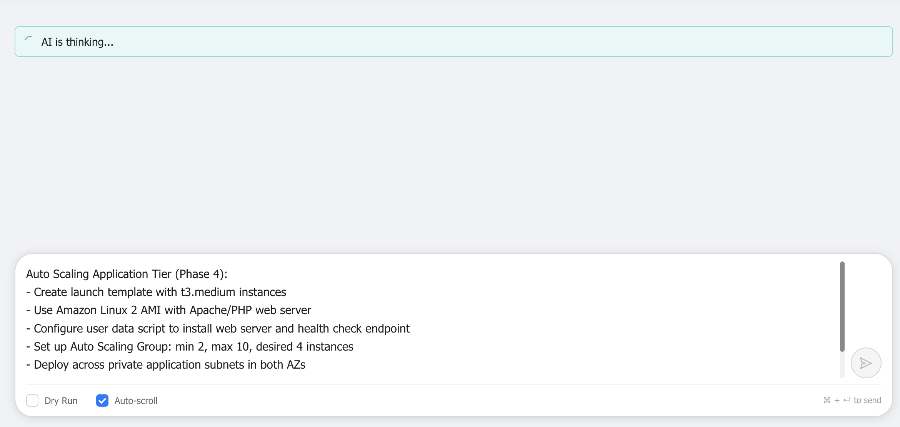

*Enter the auto-scaling application tier request. The AI will create launch templates, auto-scaling groups, and integrate with the load balancer.*

### Review and Execute Auto Scaling Configuration

Review the comprehensive application tier plan, then click **"Confirm & Execute"** to deploy the auto-scaling infrastructure.

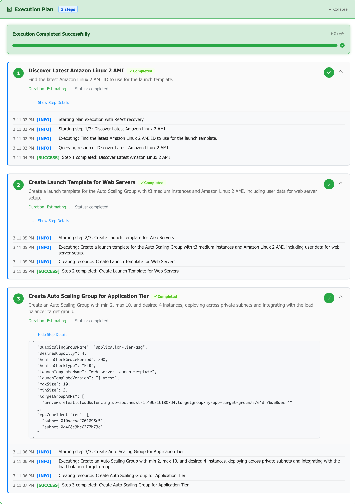

*After successful execution, the application tier is deployed with:*
- *Launch template with t3.medium instances and user data script*
- *Auto Scaling Group spanning private subnets in both AZs*
- *Integration with load balancer target group for automatic registration*
- *ELB health checks with proper grace period*
- *Scaling policies for automatic capacity management*

**What's Created in Phase 4:**
1. **Launch Template**: 
   - Instance type: t3.medium
   - AMI: Latest Amazon Linux 2
   - Security group: Application server security group from Phase 2
   - User data script: Installs Apache, PHP, and configures /health endpoint
2. **Auto Scaling Group**:
   - Min capacity: 2 instances
   - Max capacity: 10 instances
   - Desired capacity: 4 instances
   - Subnets: Private application subnets from Phase 1
3. **Load Balancer Integration**:
   - Automatic target group registration
   - ELB health checks enabled
   - Health check grace period: 300 seconds
4. **High Availability**:
   - Instances distributed across both availability zones
   - Automatic replacement of unhealthy instances

The application tier is now running and ready to serve web traffic with automatic scaling based on demand!

## Phase 5: Database Infrastructure

**Goal:** Deploy a Multi-AZ RDS MySQL database with encryption, automated backups, and monitoring.

### Enter Your Database Infrastructure Request

Finally, let's create the database tier to complete our three-tier architecture:

```
Database Infrastructure (Phase 5):
- Create RDS MySQL 8.0 database with Multi-AZ deployment
- Use db.t3.medium instance class with 100GB GP3 storage
- Enable encryption at rest and Performance Insights
- Configure automated backups: 7-day retention, 3-4 AM backup window
- Set maintenance window: Sunday 4-5 AM
- Deploy across database subnets in both AZs
```

Click **"Process Request"** to generate the database deployment plan.

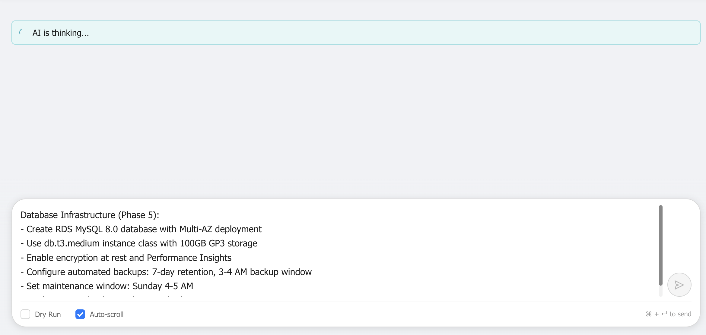

*Enter the database infrastructure request. The AI will create a production-ready RDS database with Multi-AZ deployment and all necessary configurations.*

### Monitor Database Creation

Review the database deployment plan, then click **"Confirm & Execute"** to start the RDS deployment. The database creation process takes longer than other resources due to the Multi-AZ setup:

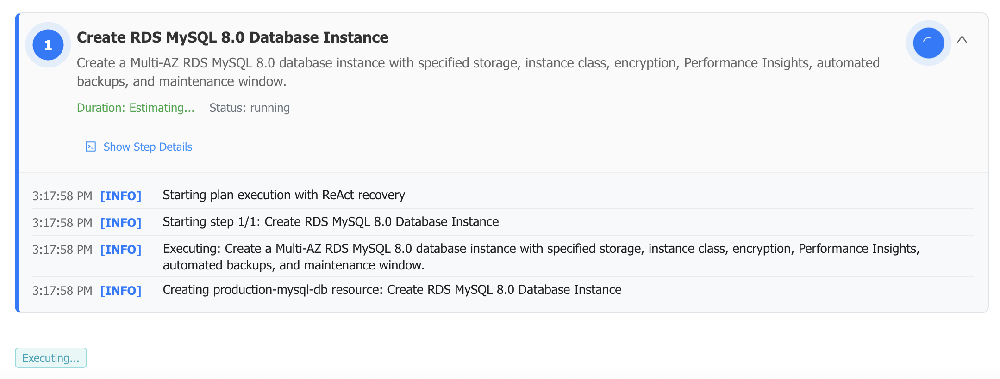

*The RDS deployment is in progress. This process typically takes 10-15 minutes as AWS:*
- *Provisions the primary database instance*
- *Sets up the standby instance in the second availability zone*
- *Configures synchronous replication between primary and standby*
- *Applies encryption settings and initializes Performance Insights*
- *Configures automated backup settings and maintenance windows*

> **Database Creation Timeline:** RDS Multi-AZ deployments typically take 10-15 minutes to complete. The AI agent will wait for the database to become available before marking this phase as complete. During this time, AWS is setting up the primary and standby instances, configuring replication, and applying all security and backup settings.

**What's Being Created in Phase 5:**
1. **DB Subnet Group**: Spans database subnets from Phase 1
2. **RDS MySQL Instance**:
   - Engine: MySQL 8.0
   - Instance class: db.t3.medium
   - Storage: 100GB GP3 with encryption at rest
   - Multi-AZ: Primary and standby instances
3. **Security Configuration**:
   - Security group: Database security group from Phase 2
   - VPC: Deployed in isolated database subnets
5. **Monitoring**: Performance Insights enabled for query analysis

### Verify Database in AWS Console

After the database creation completes, verify it in the AWS Console:

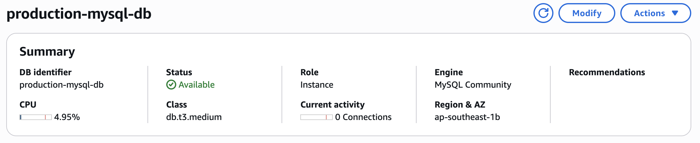

*Navigate to RDS → Databases in the AWS Console to verify:*
- *Database status shows "Available"*
- *Multi-AZ deployment is active with standby instance*
- *Engine version is MySQL 8.0*
- *Encryption is enabled and Performance Insights is active*
- *Backup retention is set to 7 days*
- *Database is deployed in the correct VPC and subnet group*

**Verify Database Configuration:**
- Database status: "Available"
- Multi-AZ: "Yes" with standby in different AZ
- Instance class: db.t3.medium
- Storage: 100GB GP3 encrypted
- Performance Insights: Enabled
- Security group: Database security group attached

## Understanding the Complete Infrastructure

Let's review the complete three-tier architecture that the AI Infrastructure Agent has created:

### Architecture Overview

**Presentation Tier (Public Subnets)**
- Application Load Balancer distributing traffic across availability zones
- Health checks ensuring only healthy instances receive traffic
- Internet Gateway providing public access

**Application Tier (Private Subnets)**
- Auto Scaling Group maintaining 2-10 instances based on demand
- t3.medium instances with Apache/PHP web server
- Automatic registration with load balancer target group
- NAT Gateway for secure outbound internet access

**Data Tier (Database Subnets)**
- Multi-AZ RDS MySQL 8.0 with automatic failover
- Encryption at rest with Performance Insights
- Automated backups with 7-day retention
- Isolated subnets with no internet access

### Security Architecture

**Defense in Depth:**
1. **Network Isolation**: Three-tier subnet architecture
2. **Security Groups**: Layered access controls between tiers
3. **Encryption**: Database encryption at rest
4. **Private Subnets**: Application and database tiers have no direct internet access

### High Availability Features

**Multi-AZ Deployment:**
- Load balancer spans both availability zones
- Auto Scaling Group distributes instances across AZs
- RDS Multi-AZ with automatic failover

**Automatic Recovery:**
- Health checks replace unhealthy instances
- Load balancer routes around failed instances
- RDS automatic failover in case of primary instance failure

## Testing Your Three-Tier Application

### Access Your Application

1. **Find the Load Balancer DNS Name**: Check the Infrastructure Resources page for the ALB endpoint
2. **Test HTTP Access**: 
   ```bash
   curl http://your-alb-endpoint.ap-southeast-1.elb.amazonaws.com
   ```
3. **Test Health Endpoint**:
   ```bash
   curl http://your-alb-endpoint.ap-southeast-1.elb.amazonaws.com/health
   ```

### Monitor Your Infrastructure

**Load Balancer Metrics:**
- Navigate to EC2 → Load Balancers → Monitoring
- Monitor request count, latency, and target health

**Auto Scaling Activity:**
- Navigate to EC2 → Auto Scaling Groups → Activity
- Monitor scaling activities and instance health

**Database Performance:**
- Navigate to RDS → Databases → Performance Insights
- Monitor query performance and database load

## Scaling and Optimization

### Horizontal Scaling

The auto-scaling group automatically adjusts based on demand:
- **Scale Out**: Additional instances launch during high traffic
- **Scale In**: Excess instances terminate during low traffic
- **Health-Based**: Only healthy instances receive traffic

### Performance Optimization

**Application Tier:**
- Consider using Application Load Balancer sticky sessions for stateful applications
- Implement application-level caching (Redis/ElastiCache)
- Use CloudFront CDN for static content delivery

**Database Tier:**
- Monitor Performance Insights for query optimization opportunities
- Consider read replicas for read-heavy workloads
- Implement connection pooling in your application

### Cost Optimization

**Right-Sizing:**
- Monitor CloudWatch metrics to optimize instance sizes
- Use AWS Compute Optimizer recommendations
- Consider Reserved Instances for predictable workloads

**Storage Optimization:**
- Enable RDS storage autoscaling
- Monitor storage utilization and adjust as needed
- Consider storage type optimization (GP3 vs GP2)

## Security Best Practices

### Network Security

1. **VPC Flow Logs**: Enable for network traffic monitoring
2. **NAT Gateway**: Provides secure outbound access for private subnets
3. **Security Group Rules**: Principle of least privilege access

### Database Security

1. **Encryption**: All data encrypted at rest and in transit
2. **Network Isolation**: Database in dedicated private subnets
3. **Access Control**: Database accessible only from application tier
4. **Backup Encryption**: Automated backups are encrypted

### Application Security

1. **Private Subnets**: Web servers not directly accessible from internet
2. **Load Balancer**: Single point of entry with security group controls
3. **Auto Scaling**: Automatic replacement of compromised instances

## Troubleshooting Common Issues

### Load Balancer Issues

**503 Service Unavailable:**
- Check target group health status
- Verify security group rules allow traffic from ALB to instances
- Ensure health check endpoint (`/health`) is responding

**High Latency:**
- Monitor target group response times
- Check application server CPU and memory usage
- Consider scaling up instance types or scaling out count

### Auto Scaling Issues

**Instances Not Launching:**
- Verify launch template configuration
- Check subnet capacity and availability
- Review IAM roles and permissions

**Health Check Failures:**
- Check ELB health check configuration
- Verify application is listening on correct port
- Review security group rules

### Database Connectivity Issues

**Cannot Connect from Application:**
- Verify database security group allows MySQL (3306) from application security group
- Check database subnet group configuration
- Ensure RDS endpoint is resolved correctly

**Performance Issues:**
- Use Performance Insights to identify slow queries
- Monitor database CPU and memory usage
- Consider scaling up instance class or adding read replicas

## Next Steps and Enhancements

### Monitoring and Logging

1. **CloudWatch Dashboards**: Create custom dashboards for application metrics
2. **CloudWatch Alarms**: Set up alerts for key metrics (CPU, latency, errors)
3. **Application Logging**: Implement centralized logging with CloudWatch Logs
4. **X-Ray Tracing**: Add distributed tracing for request tracking

### Security Enhancements

1. **WAF**: Add Web Application Firewall to the load balancer
2. **Certificate Manager**: Enable HTTPS with SSL/TLS certificates
3. **Secrets Manager**: Store database credentials securely
4. **IAM Roles**: Use instance roles instead of access keys

### Performance and Scaling

1. **ElastiCache**: Add Redis caching layer for improved performance
2. **CloudFront**: Implement CDN for global content delivery
3. **Read Replicas**: Add RDS read replicas for read-heavy workloads
4. **Lambda**: Consider serverless functions for specific tasks

### Backup and Disaster Recovery

1. **Cross-Region Backup**: Set up cross-region RDS backup replication
2. **Infrastructure as Code**: Convert to CloudFormation or Terraform
3. **Blue-Green Deployment**: Implement zero-downtime deployment strategy
4. **Multi-Region**: Consider multi-region deployment for disaster recovery

## Conclusion

You've successfully deployed a complete three-tier web application infrastructure using the AI Infrastructure Agent through natural language commands. The infrastructure includes:

**Production-Ready Features:**
- Multi-AZ high availability architecture
- Auto-scaling application tier with load balancing
- Secure database tier with encryption and automated backups
- Defense-in-depth security with layered access controls
- Monitoring and health checks throughout all tiers

**Enterprise Capabilities:**
- Automatic failover and recovery
- Scalable architecture handling variable loads
- Security best practices with network isolation
- Comprehensive monitoring and alerting
- Automated backup and maintenance

The natural language interface made it possible to create this complex infrastructure without needing to:
- Remember specific AWS API parameters
- Manually configure security group references
- Calculate subnet CIDR blocks
- Navigate multiple AWS Console pages

Each phase built upon the previous one, with the AI agent intelligently reusing resources and maintaining state across the entire deployment. This approach demonstrates how modern AI can simplify complex infrastructure deployments while maintaining enterprise-grade security and reliability standards.