# How to Use the AI Agent to Create a Virtual Private Cloud (VPC)

Welcome to this comprehensive guide on using the AI Infrastructure Agent to create a production-ready VPC through natural language commands. This tutorial demonstrates how to build a complete network infrastructure with public and private subnets, internet gateways, and NAT gateways across multiple availability zones.

## Quick Start with Docker

The fastest way to get started is using Docker. Follow these steps to have the AI Infrastructure Agent running in minutes:

### Step 1: Clone the Repository

```bash
git clone https://github.com/VersusControl/ai-infrastructure-agent.git
cd ai-infrastructure-agent
```

### Step 2: Configure Your AI Provider

Choose your preferred AI provider and set up the configuration:

```bash
# For OpenAI (Recommended)
cp config.openai.yaml.example config.yaml

# For Google Gemini
cp config.gemini.yaml.example config.yaml

# For AWS Bedrock Nova
cp config.bedrock.yaml.example config.yaml
```

### Step 3: Run with Docker

```bash
# Build and start the container
docker build -t ai-infrastructure-agent .
docker run -d \
  -p 8080:8080 \
  -v $(pwd)/config.yaml:/app/config.yaml \
  -e AWS_ACCESS_KEY_ID=$AWS_ACCESS_KEY_ID \
  -e AWS_SECRET_ACCESS_KEY=$AWS_SECRET_ACCESS_KEY \
  -e AWS_DEFAULT_REGION=$AWS_DEFAULT_REGION \
  --name ai-agent \
  ghcr.io/versuscontrol/ai-infrastructure-agent
```

Open your browser and navigate to:

```
http://localhost:8080
```

You should see the AI Infrastructure Agent dashboard, ready to accept your infrastructure requests!

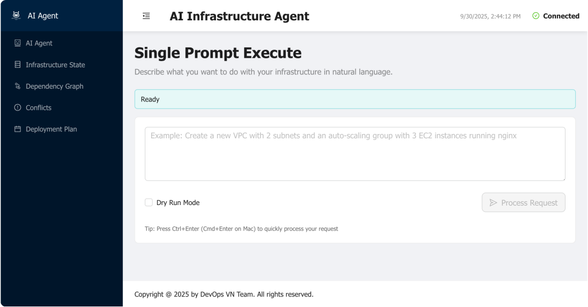

> **For detailed installation instructions** including manual setup, troubleshooting, and advanced configurations, please refer to the [Getting Started Guide](../getting-started.md).

## Understanding VPC Architecture

A well-designed VPC forms the foundation of secure and scalable AWS infrastructure. This guide walks you through creating a production-ready VPC with:

- **Public Subnets**: For internet-facing resources like load balancers and bastion hosts
- **Private Subnets**: For application servers and databases that shouldn't be directly accessible from the internet
- **Multiple Availability Zones**: For high availability and fault tolerance
- **Internet Gateway**: For public subnet internet connectivity
- **NAT Gateway**: For private subnet outbound internet access

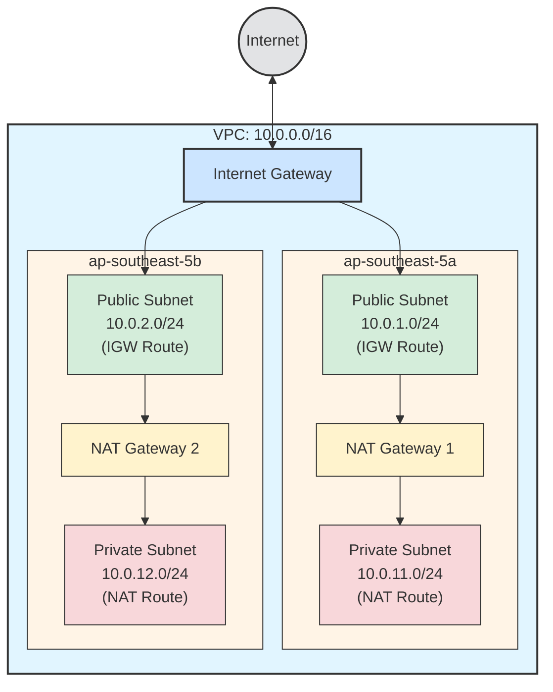

Let's build this infrastructure step by step using natural language commands.

## Step 1: Create the Production VPC

**Goal:** Create a VPC with a CIDR block large enough to support multiple subnets across availability zones.

### Enter Your Request

In the Web UI dashboard, type your infrastructure request in natural language:

```
Create a production VPC with a CIDR block of 10.0.0.0/16
```

Then click **"Process Request"** to let the AI analyze your requirements.

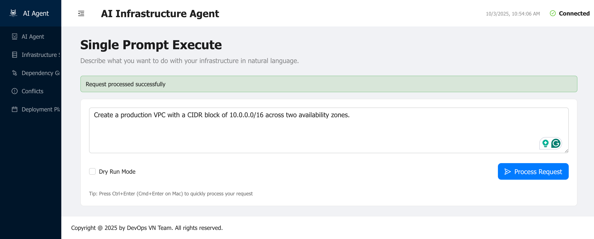

*Enter your VPC creation request in the dashboard. The AI will analyze the requirements and generate an execution plan.*

### Review and Execute the Plan

After processing, the AI agent will present a detailed execution plan showing the VPC creation step. Review the plan to ensure:
- The CIDR block is correctly set to `10.0.0.0/16`
- DNS support and DNS hostnames are enabled for proper name resolution
- The VPC will be created in your configured AWS region

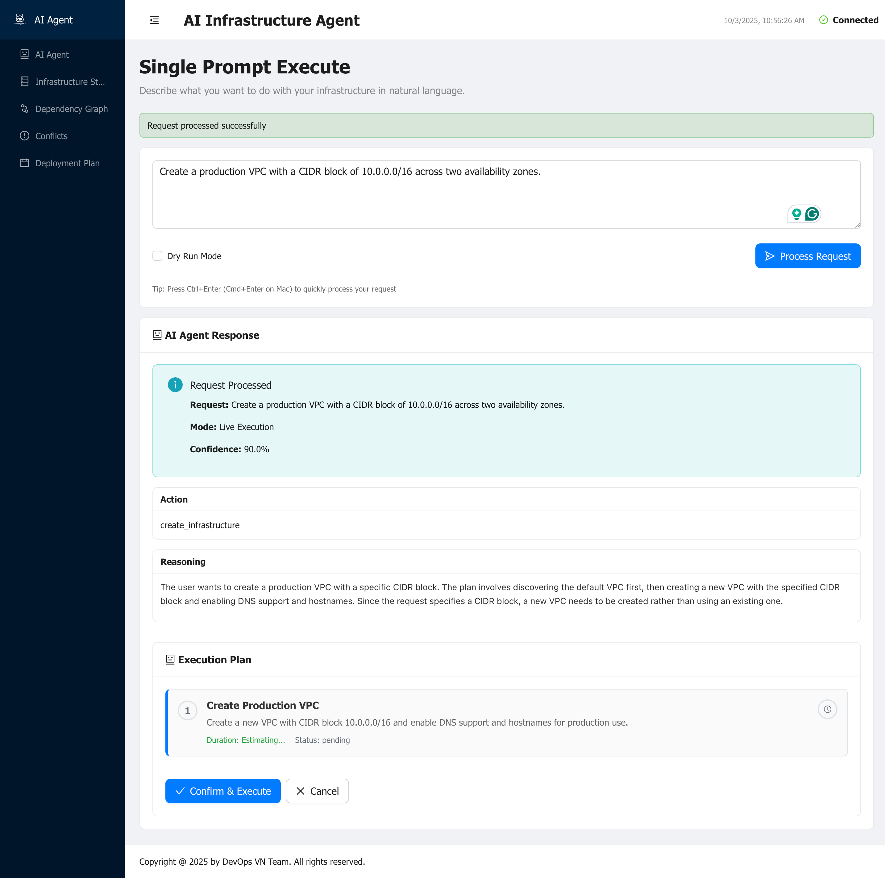

*The AI generates a simple execution plan for VPC creation with proper CIDR configuration and DNS settings enabled.*

Click **"Confirm & Execute"** to create the VPC.

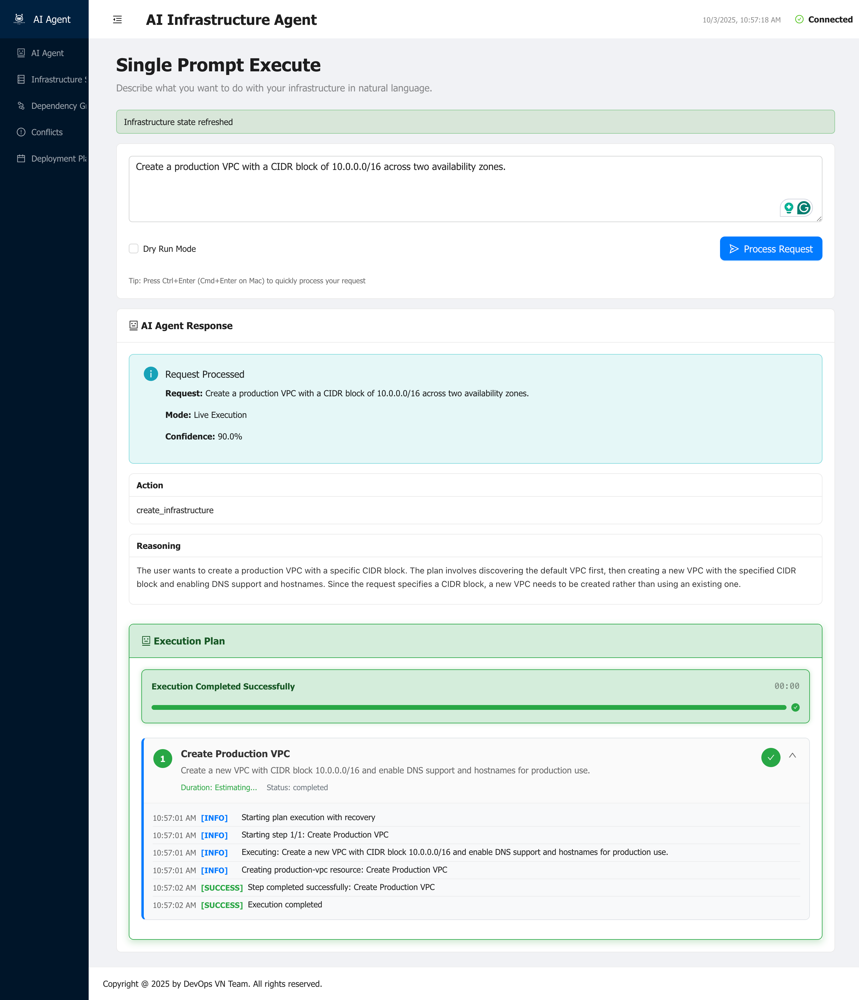

*The VPC creation executes successfully. Note the VPC ID that will be used in subsequent steps.*

### Verify the VPC Creation

After successful execution, check the Infrastructure Resources page to see your newly created VPC:

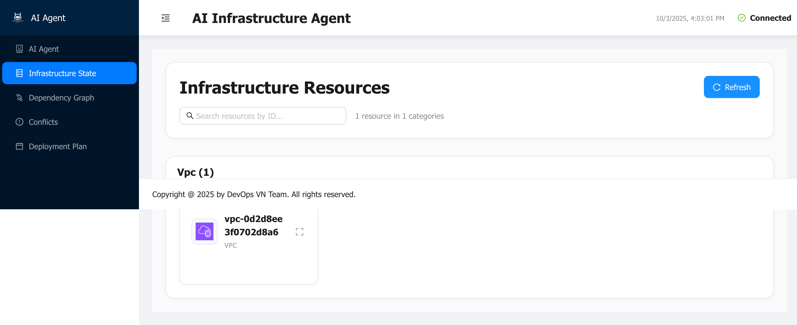

*The Infrastructure Resources page shows the created VPC with its ID (e.g., vpc-0123456789abcdef0). This ID will be referenced when creating subnets and other resources.*

**What was created:**
- ✅ VPC with CIDR block `10.0.0.0/16`
- ✅ DNS resolution enabled
- ✅ DNS hostnames enabled
- ✅ Default route table, network ACL, and security group

> **Important:** Note the VPC ID from the dashboard. You can use it explicitly in future requests for consistency, or you can reference it naturally (e.g., "in the production VPC we just created").

## Step 2: Set Up Public Subnets with Internet Gateway

**Goal:** Create public subnets across two availability zones in ap-southeast-5 with proper internet connectivity.

### Enter Your Request

Now let's create the public subnets with internet access:

```
Set up public subnets (10.0.1.0/24 and 10.0.2.0/24) for internet-facing across two availability zones in ap-southeast-5 and configure the Internet Gateway for proper routing.
```

Click **"Process Request"** to generate the plan.

### Review the Comprehensive Plan

The AI will generate a detailed plan that includes:
- Creating two public subnets in different availability zones
- Creating an Internet Gateway
- Attaching the Internet Gateway to the VPC
- Creating a public route table
- Adding a route to the Internet Gateway (0.0.0.0/0 → igw)
- Associating both subnets with the public route table
- Enabling auto-assign public IP for the subnets

*The execution plan shows all the steps required to create a properly configured public subnet infrastructure. Each subnet will be in a different availability zone for high availability.*

**What's included in the plan:**
1. **Subnet Creation**: Two subnets (10.0.1.0/24 and 10.0.2.0/24) in ap-southeast-5a and ap-southeast-5b
2. **Internet Gateway**: Created and attached to the VPC
3. **Public Route Table**: New route table for public subnets
4. **Internet Route**: 0.0.0.0/0 pointing to the Internet Gateway
5. **Subnet Associations**: Both subnets associated with the public route table
6. **Auto-assign Public IP**: Enabled for instances launched in these subnets

Click **"Confirm & Execute"** to create the public subnet infrastructure.

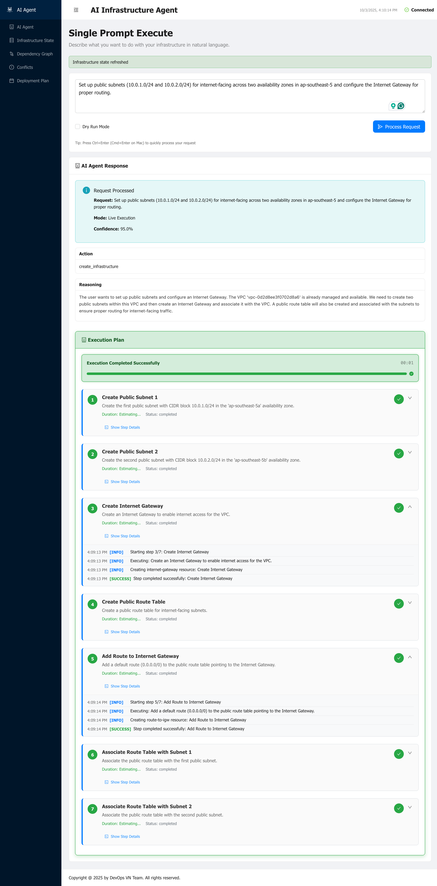

### Verify in AWS Console

After execution completes, verify the resources in the AWS Console:

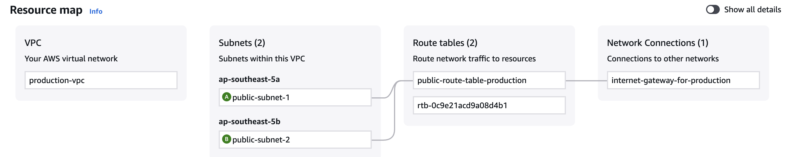

*Navigate to VPC → Subnets in the AWS Console to verify:*
- *Two public subnets are created in different availability zones*
- *Each subnet has the correct CIDR block*
- *Auto-assign public IPv4 is enabled*
- *Subnets are associated with the correct route table*
- *Internet Gateway is attached and routing is configured*

**What to verify:**
- ✅ Subnets exist in ap-southeast-5a and ap-southeast-5b
- ✅ CIDR blocks are 10.0.1.0/24 and 10.0.2.0/24
- ✅ Auto-assign public IP is enabled
- ✅ Internet Gateway is attached to the VPC
- ✅ Route table has 0.0.0.0/0 → igw route

## Step 3: Set Up Private Subnets with NAT Gateway

**Goal:** Create private subnets for application servers with outbound internet access via NAT Gateway, but no inbound internet access.

### Enter Your Request

Now let's create the private subnets with NAT Gateway for outbound connectivity:

```
Set up private subnets for application servers (10.0.11.0/24 and 10.0.12.0/24) across two availability zones in ap-southeast-5 and configure the NAT Gateway for proper routing.
```

Click **"Process Request"** to generate the plan.

### Review the Advanced Plan

The AI generates a comprehensive plan for private subnet infrastructure:

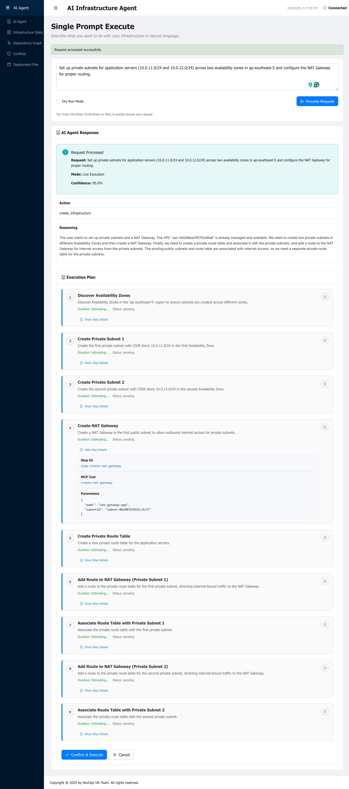

*The execution plan for private subnets includes:*
- *Creating two private subnets in different availability zones*
- *Allocating Elastic IPs for NAT Gateways*
- *Creating NAT Gateways in public subnets*
- *Creating private route tables*
- *Adding routes to NAT Gateways for outbound internet access*
- *Associating subnets with private route tables*

**What's included in the plan:**
1. **Private Subnet Creation**: Two subnets (10.0.11.0/24 and 10.0.12.0/24)
2. **Elastic IP Allocation**: One or more EIPs for NAT Gateway(s)
3. **NAT Gateway Creation**: NAT Gateway(s) in public subnet(s)
4. **Private Route Tables**: Separate route tables for private subnets
5. **NAT Routes**: 0.0.0.0/0 pointing to NAT Gateway for outbound traffic
6. **Subnet Associations**: Private subnets associated with private route tables

Click **"Confirm & Execute"** to start the deployment.

### Monitor Execution Progress

The execution process for NAT Gateway involves several steps, including waiting for resources to become available:

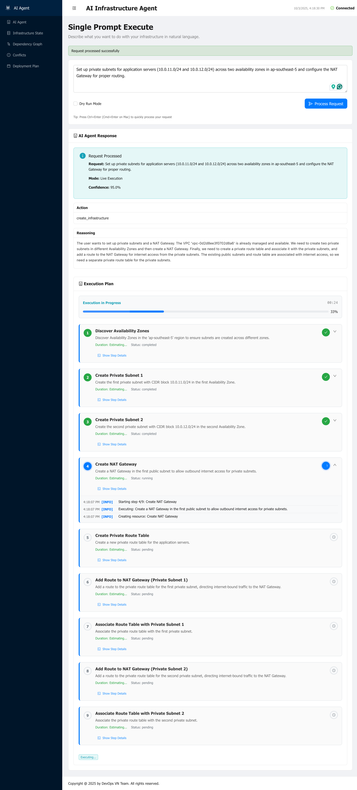

*During execution, you'll see the agent creating the NAT Gateway and waiting for it to become available. NAT Gateways typically take 1-2 minutes to reach the "available" state.*

**What happens during execution:**
- ✅ Private subnets are created
- ✅ Elastic IP(s) are allocated
- ⏳ NAT Gateway is being created (this takes time)
- ⏳ Waiting for NAT Gateway to become available
- ✅ Route tables are created
- ✅ Routes to NAT Gateway are added

### Handling Errors and Recovery

During complex infrastructure deployments, the AI agent may encounter errors. The built-in recovery mechanism helps handle these situations:

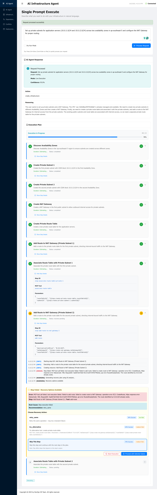

*At step 8, an error occurred during the execution. The AI agent automatically triggers a recovery plan to analyze and fix the issue.*

> **AI Can Make Mistakes:** The AI agent, while powerful, may occasionally generate plans with minor errors or make assumptions that don't match the actual AWS environment state. The recovery mechanism helps identify and fix these issues.

For this example, we chose to **skip this step** as the core infrastructure was already in place.

### Verify Complete Infrastructure

After recovery and completion, check the final state of your infrastructure:

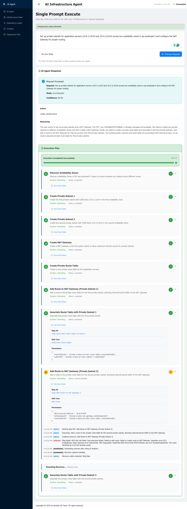

*The execution completes successfully (with the skipped step noted). All critical infrastructure components are in place.*

### Review All Created Resources

Navigate to the Infrastructure Resources page to see the complete inventory:

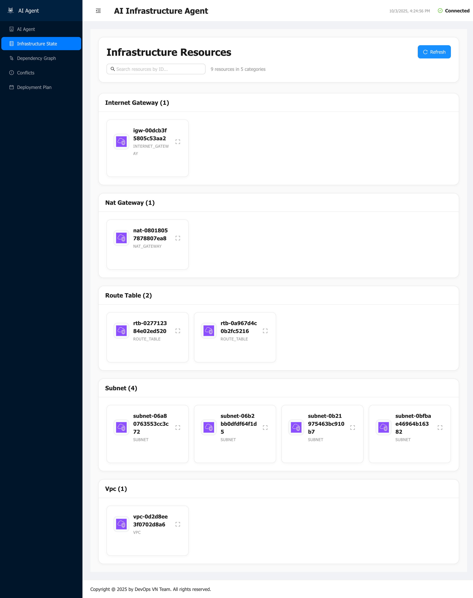

*The Infrastructure Resources page shows all created resources:*
- *VPC with CIDR 10.0.0.0/16*
- *2 Public subnets in different AZs*
- *2 Private subnets in different AZs*
- *Internet Gateway attached to VPC*
- *NAT Gateway(s) for private subnet internet access*
- *Route tables properly configured*
- *Elastic IP(s) allocated*

### Final Verification in AWS Console

Verify the complete VPC infrastructure in the AWS Console:

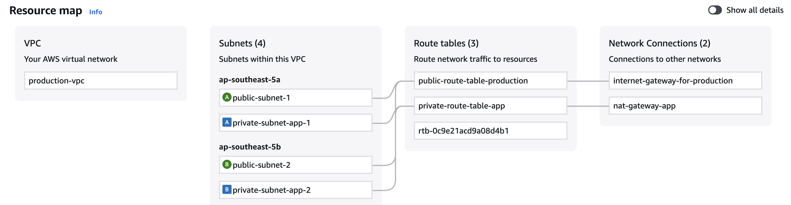

*Navigate to VPC Dashboard to see the complete network topology:*
- *VPC with all subnets visible*
- *Public subnets with Internet Gateway route*
- *Private subnets with NAT Gateway route*
- *All resources properly tagged and organized*

**Complete infrastructure inventory:**
- ✅ 1 VPC (10.0.0.0/16)
- ✅ 2 Public Subnets (10.0.1.0/24, 10.0.2.0/24) in ap-southeast-5a and ap-southeast-5b
- ✅ 2 Private Subnets (10.0.11.0/24, 10.0.12.0/24) in ap-southeast-5a and ap-southeast-5b
- ✅ 1 Internet Gateway
- ✅ 1 or 2 NAT Gateways (for high availability)
- ✅ Public and private route tables properly configured
- ✅ Elastic IP(s) for NAT Gateway(s)

## Conclusion

Congratulations! You've successfully created a production-ready VPC infrastructure using the AI Infrastructure Agent:

✅ **Created a VPC** with proper CIDR block planning (10.0.0.0/16)  
✅ **Set up public subnets** across multiple availability zones with Internet Gateway  
✅ **Configured private subnets** with NAT Gateway for secure outbound access  
✅ **Implemented high availability** by spanning resources across two AZs  
✅ **Verified infrastructure** in both the dashboard and AWS Console

### What's Next?

Now that your VPC is ready, you can:
- Deploy EC2 instances in private subnets
- Create Application Load Balancers in public subnets
- Set up RDS databases with Multi-AZ deployment
- Configure Auto Scaling Groups for high availability
- Implement security groups and NACLs for fine-grained access control

For more examples, check out:
- [Working with EC2 Instances](working-with-ec2-instance.md)
- [Getting Started Guide](../getting-started.md)
- [Architecture Overview](../architecture/architecture-overview.md)
